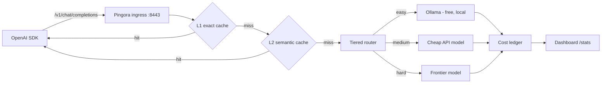

# TokenMiser

[](LICENSE)
[](https://www.rust-lang.org)
[](https://github.com/openintelligence-labs/tokenmiser/releases)

> **Smart LLM router that cuts agent costs by 10x.** Drop-in OpenAI-compatible proxy. Routes simple queries to cheap/local models, hard ones to frontier. Dual-layer semantic caching, real-time cost dashboard, shadow-mode quality A/B.

⭐ **Star us on GitHub** if your monthly LLM bill makes you wince.

## Why this exists

LiteLLM does basic routing. Portkey is closed source. Nothing combines routing + semantic caching + cost tracking + quality comparison in one open source tool. TokenMiser is that tool — a Rust proxy you put in front of your LLM calls. One import change, instant savings.

Local-by-default: with zero API keys, TokenMiser auto-detects a running [Ollama](https://ollama.com) and routes easy traffic to it for free. Add provider keys when you want frontier models. No telemetry, ever.

## Quick start

```bash
git clone https://github.com/openintelligence-labs/tokenmiser
cd tokenmiser && cargo build --release
./target/release/tokenmiser        # proxy on :8443, dashboard at http://localhost:8443/
```

Or grab a prebuilt binary from [Releases](https://github.com/openintelligence-labs/tokenmiser/releases) — macOS (Apple Silicon + Intel) and Linux (x86_64 + aarch64) tarballs with `.sha256` checksums. Windows isn't supported yet (the Pingora ingress is unix-only); use WSL in the meantime.

Point your OpenAI SDK at it:

```python
from openai import OpenAI
client = OpenAI(base_url="http://localhost:8443/v1", api_key="unused")
resp = client.chat.completions.create(
    model="auto",  # let the router pick — or pass any provider model id
    messages=[{"role": "user", "content": "hello"}],
)
```

Every response carries routing headers so you can audit each decision:

```
x-tokenmiser-cache: miss | l1-hit | l2-hit
x-tokenmiser-difficulty: easy | medium | hard
x-tokenmiser-tier: explicit | heuristic | semantic | cascade
x-tokenmiser-routed-to: <resolved model>
```

## Features

| Feature | What it does |
|---|---|
| Drop-in proxy | OpenAI-compatible `/v1/chat/completions`, streaming (SSE) and non-streaming, built on Pingora |
| Tiered router | Tier 0 heuristics → Tier 1 semantic classifier → Tier 2 speculative cascade |
| Dual-layer cache | L1 exact-match + L2 semantic (bge-small embeddings, cosine ≥ 0.87) |
| Provider adapters | OpenAI, Anthropic, Ollama — plus static aliases for anything else |
| Cost ledger | Real-time USD spent/saved from a canonical `pricing/pricing.json` |
| Live dashboard | `/` on the proxy port: savings, cache hit rates, per-route costs |
| Quality judge | Shadow-mode A/B with LLM-as-judge win-rate auto-gate (needs a frontier key) |
| Policy DSL | Rhai routing policies + `tokenmiser policy test` replay against request logs |
| MCP budgets | Per-agent/per-tool spend caps via `/v1/mcp/*` budget gateway |
| Local-first | Auto-detects Ollama, works with zero API keys, zero telemetry |

## How it works



## Configuration

Zero config required. To customize, point `TOKENMISER_CONFIG` at a YAML file:

```yaml
listen:
  proxy_addr: "0.0.0.0:8443"   # OpenAI-compatible ingress + dashboard
  admin_addr: "0.0.0.0:9443"   # admin surface
providers:
  - name: ollama               # auto-detected if running; free tier
    kind: ollama
    base_url: "http://localhost:11434"
    default_model: llama3.2
  - name: openai               # used only if OPENAI_API_KEY is set
    kind: openai
    base_url: "https://api.openai.com/v1"
    api_key_env: OPENAI_API_KEY
  - name: anthropic            # used only if ANTHROPIC_API_KEY is set
    kind: anthropic
    base_url: "https://api.anthropic.com/v1"
    api_key_env: ANTHROPIC_API_KEY
routing:
  default_provider: ollama
cache:
  l1_enabled: true
  l2_enabled: true
  semantic_threshold: 0.87     # cosine similarity for L2 hits (precision-tuned)
  scope: tenant                # tenant | user | session | global
```

## Roadmap

- [x] Pingora ingress + OpenAI-compatible `/v1/chat/completions`
- [x] L1 exact cache + cost meter + canonical `pricing.json`
- [x] L2 semantic cache (bge-small embeddings)
- [x] Tier 0/1 router (heuristic + semantic classifier)
- [x] Tier 2 speculative cascade
- [x] Auto-detect Ollama + zero-config local routing
- [x] Streaming SSE + cross-provider normalization
- [x] Shadow-mode A/B + LLM-as-judge auto-gate
- [x] Policy DSL (Rhai) + replay-test command
- [x] MCP gateway + per-tool budgets
- [ ] HNSW index for large L2 caches
- [ ] Budget alerts + automatic fallback
- [ ] Multi-tenant persistence

## Part of the Open Intelligence Labs ecosystem

- [actants](https://github.com/openintelligence-labs/actants) — TokenMiser is the default LLM layer
- [AgentTrace](https://github.com/openintelligence-labs/agenttrace) — cost data feeds into trace cost attribution
- [DeepDive](https://github.com/openintelligence-labs/deepdive) — first consumer to use routing for search vs. analysis

## Contributing

Issues and PRs welcome. Run `cargo fmt`, `cargo clippy --workspace --all-targets`, and `cargo test --workspace` before submitting.

## License

MIT
