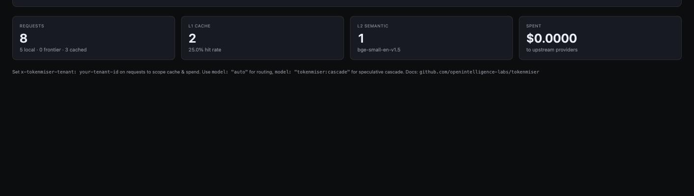
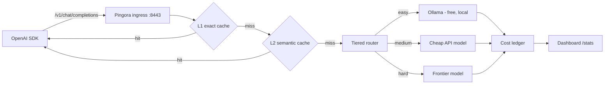

# TokenMiser

[](LICENSE)
[](https://www.rust-lang.org)
[](https://github.com/openintelligence-labs/tokenmiser/releases)

> **A local proxy that cuts your LLM bill.** Point your OpenAI SDK at it and it routes easy work to free local models, serves repeats and near-repeats from cache, and collapses duplicate concurrent calls into one — while showing you exactly what you spent and saved.



## Quick start

```bash
cargo install tokenmiser        # or: download a binary from Releases
tokenmiser serve                # proxy on :8443, dashboard at http://localhost:8443/
```

Change one line in your app:

```python
from openai import OpenAI
client = OpenAI(base_url="http://localhost:8443/v1", api_key="unused")
```

That's the whole integration. With [Ollama](https://ollama.com) running you need no API keys at all — TokenMiser detects it and routes there for free. Add provider keys when you want frontier models.

Prebuilt binaries for macOS (Apple Silicon), Linux (x86_64 + aarch64) and Windows x64 are on the [Releases](https://github.com/openintelligence-labs/tokenmiser/releases) page, each with a `.sha256`. Intel macs must build from source — the embedding runtime (`ort`) ships no prebuilt ONNX Runtime for x64 macOS.

## What it actually saves

Measured on the repo's load battery (242 requests, 120-way concurrency, mixed streaming and non-streaming, against local Ollama):

| | |
|---|---|
| Cached response latency | **p50 0.29 ms** (vs. 275 ms uncached) |
| Upstream calls on a 120-request identical burst | **61**, not 120 — the rest coalesced |
| Proxy overhead on a cache miss | below run-to-run variance of the model itself |
| Memory under sustained load | flat, ~262 MB |

Your savings depend entirely on your traffic: repetitive agent loops and RAG workloads with recurring questions benefit most; every-request-unique traffic benefits least. The dashboard tells you which you have rather than asking you to guess.

## Why this exists

LiteLLM does routing. Portkey is closed source. Nothing open source combines routing, semantic caching, honest cost accounting and quality comparison in one binary you run yourself. TokenMiser is a Rust proxy that does — local-by-default, no signup, no telemetry, ever.

## Using it

Pass `model="auto"` to let the router choose, or name any provider model
directly. `model="tokenmiser:cascade"` tries a cheap model first and escalates
only if the answer looks weak.

`stream=True` works as usual: chunks pass through as SSE, the finished response
is cached, and a later cache hit replays as a stream rather than a single
blob. `client.models.list()` returns the router pseudo-models plus every
installed Ollama model.

Every response carries routing headers so you can audit each decision:

```
x-tokenmiser-cache: miss | l1-hit | l2-hit
x-tokenmiser-difficulty: easy | medium | hard
x-tokenmiser-tier: explicit | heuristic | semantic | cascade
x-tokenmiser-routed-to: <resolved model>
x-tokenmiser-budget: ok | exceeded          (when budget limits are configured)
```

## Features

| Feature | What it does |
|---|---|
| Drop-in proxy | OpenAI-compatible `/v1/chat/completions` + `/v1/models`, streaming (SSE) and non-streaming, built on Pingora |
| Tiered router | Tier 0 heuristics → Tier 1 semantic classifier → Tier 2 speculative cascade |
| Dual-layer cache | L1 exact-match + L2 semantic (bge-small embeddings, cosine ≥ 0.87); streamed responses cached too, hits replay as streams |
| Provider adapters | OpenAI, Anthropic, Ollama — plus static aliases for anything else. The OpenAI and Ollama adapters are verified end-to-end against live APIs; the Anthropic adapter is covered by unit tests only (see [Verification](#verification)) |
| Cost ledger | Real-time USD spent/saved (lifetime + current UTC day) from a canonical `pricing/pricing.json` |
| Budget alerts | Optional daily/total USD limits — warn via `/stats` + header + log, or reject paid calls with 402 (`enforce: true`); local traffic always passes |
| Live dashboard | `/` on the proxy port: savings, cache hit rates, per-route costs |
| Quality judge | Shadow-mode A/B with LLM-as-judge win-rate auto-gate (needs a frontier key) |
| Policy DSL | Rhai routing policies + `tokenmiser policy test` replay against request logs |
| MCP budgets | Per-agent/per-tool spend caps via `/v1/mcp/*` budget gateway |
| Local-first | Auto-detects Ollama, works with zero API keys, zero telemetry |

## How it works



## Configuration

Zero config required. To customize, point `TOKENMISER_CONFIG` at a YAML file:

```yaml
listen:
  proxy_addr: "127.0.0.1:8443" # OpenAI-compatible ingress + dashboard
  admin_addr: "127.0.0.1:9443" # admin surface
                               # Loopback by default: this proxy is
                               # unauthenticated and spends your API budget.
                               # Bind 0.0.0.0 only if you really want anyone
                               # on your network to be able to use it.
providers:
  - name: ollama               # auto-detected if running; free tier
    kind: ollama
    base_url: "http://localhost:11434"
    default_model: llama3.2
  - name: openai               # used only if OPENAI_API_KEY is set
    kind: openai
    base_url: "https://api.openai.com/v1"
    api_key_env: OPENAI_API_KEY
  - name: anthropic            # used only if ANTHROPIC_API_KEY is set
    kind: anthropic
    base_url: "https://api.anthropic.com/v1"
    api_key_env: ANTHROPIC_API_KEY
routing:
  default_provider: ollama
cache:
  l1_enabled: true
  l2_enabled: true
  semantic_threshold: 0.87     # cosine similarity for L2 hits (precision-tuned)
  scope: tenant                # tenant | user | session | global
budget:                        # optional — omit for no budget tracking
  daily_usd: 5.0               # alert when today's spend (UTC) crosses this
  total_usd: 100.0             # alert when lifetime spend crosses this
  enforce: false               # true = reject paid-provider calls with 402 once exceeded
                               # (cache hits and local Ollama traffic always pass)
security:                      # optional — omit for the safe default
  allowed_origins: []          # browser origins allowed to drive the proxy.
                               # Empty = none (see "Browser safety" below).
```

### Browser safety (CSRF)

TokenMiser listens on loopback with no authentication — the right default for
a CLI/SDK tool, since only local processes can reach it. But your *browser* is
a local process, and any page you visit can compose a request to it:

```js
// on evil.example — no preflight, because text/plain is a CORS "simple request"
fetch("http://127.0.0.1:8443/v1/chat/completions", {
  method: "POST",
  headers: { "content-type": "text/plain" },
  body: JSON.stringify({ model: "gpt-5", messages: [{role:"user", content:"…"}] }),
});
```

CORS stops that page from *reading* the reply, but it never stopped the
request — which already spent your API budget. So TokenMiser rejects requests
carrying a cross-origin browser signal (`Sec-Fetch-Site: cross-site`, or an
`Origin` that isn't allow-listed) with **403**.

- **curl, the OpenAI SDKs, and agent frameworks are unaffected** — they send
  neither header, and are always allowed.
- **The built-in dashboard keeps working** — it is served by this same proxy,
  so its htmx polling is `Sec-Fetch-Site: same-origin`.
- **A legitimate browser app opts in** by listing its origin:

  ```yaml
  security:
    allowed_origins: ["http://localhost:3000"]
  ```

  `["*"]` disables the check entirely — this re-opens the hole for every page
  you visit, so prefer naming the origin.

### Cost reporting honesty

Ollama Cloud models (any `*-cloud` tag, e.g. `gpt-oss:20b-cloud`) run on
Ollama's paid servers, not your hardware — even though they are served through
your local Ollama daemon. TokenMiser counts them as **remote** requests, and
they are subject to `budget.enforce` like any other paid provider.

Their per-token price is not something TokenMiser can honestly encode, so
rather than reporting `$0.00` (which would read as "free"), those calls
increment an explicit `unpriced_requests` counter in `/stats` and on the
dashboard. When it is non-zero, `spent_usd` is a **lower bound** on your real
bill, and the dashboard says so.

## Verification

The test suite is fully mocked and never calls a paid API. Separately, the
paid path has been exercised against the **live OpenAI API** (`gpt-4o-mini`),
end-to-end through the proxy:

- Non-streaming and streaming (SSE) completions return correctly parsed,
  OpenAI-shaped responses, with unmodeled upstream fields passed through.
- **Cost accounting matches the provider's own reported `usage`** to the
  micro-dollar, checked against the published per-token price.
- Streamed responses are accounted at stream end and cached; the repeat is
  served from cache at $0.
- Budget enforcement was confirmed with real spend: warn mode surfaces
  `x-tokenmiser-budget: exceeded`, and `enforce: true` returns 402 on paid
  routes while local Ollama traffic and cache hits still pass.
- The router escalates to the paid provider only when the policy says so; a
  local-tier request adds no spend.
- An invalid or absent key produces a clean, OpenAI-shaped `401` with no key
  material in the response or logs.

**Not yet verified against a live API:** the **Anthropic** adapter, which is
covered by unit tests only. Gemini and DeepSeek route through the
OpenAI-compatible adapter but have not been exercised against their own
endpoints.

## Roadmap

- [x] Pingora ingress + OpenAI-compatible `/v1/chat/completions`
- [x] L1 exact cache + cost meter + canonical `pricing.json`
- [x] L2 semantic cache (bge-small embeddings)
- [x] Tier 0/1 router (heuristic + semantic classifier)
- [x] Tier 2 speculative cascade
- [x] Auto-detect Ollama + zero-config local routing
- [x] Streaming SSE (pass-through, cache write on completion, cached hits replay as streams)
- [x] Shadow-mode A/B + LLM-as-judge auto-gate
- [x] Policy DSL (Rhai) + replay-test command
- [x] MCP gateway + per-tool budgets
- [x] Budget alerts (daily/total limits; warn by default, optional 402 enforcement)
- [x] Single-flight dedup for concurrent identical misses (cache stampede)
- [ ] HNSW index for large L2 caches
- [ ] Multi-tenant persistence

## Part of the Open Intelligence Labs ecosystem

- [actants](https://github.com/openintelligence-labs/actants) — local-first agent SDK; TokenMiser sits under it as the LLM layer
- [DeepDive](https://github.com/openintelligence-labs/deepdive) — research agent that routes search and analysis differently
- [PhantomDep](https://github.com/openintelligence-labs/phantomdep) — blocks hallucinated dependencies before they install

## Contributing

Issues and PRs welcome. Run `cargo fmt`, `cargo clippy --workspace --all-targets`, and `cargo test --workspace` before submitting.

## License

MIT
