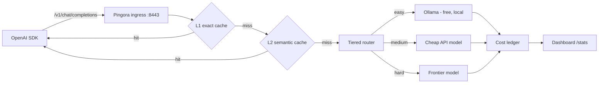

# TokenMiser

[](LICENSE)
[](https://www.rust-lang.org)
[](https://github.com/openintelligence-labs/tokenmiser/releases)

> **Smart LLM router that cuts agent costs by 10x.** Drop-in OpenAI-compatible proxy. Routes simple queries to cheap/local models, hard ones to frontier. Dual-layer semantic caching, real-time cost dashboard, shadow-mode quality A/B.

⭐ **Star us on GitHub** if your monthly LLM bill makes you wince.

## Why this exists

LiteLLM does basic routing. Portkey is closed source. Nothing combines routing + semantic caching + cost tracking + quality comparison in one open source tool. TokenMiser is that tool — a Rust proxy you put in front of your LLM calls. One import change, instant savings.

Local-by-default: with zero API keys, TokenMiser auto-detects a running [Ollama](https://ollama.com) and routes easy traffic to it for free. Add provider keys when you want frontier models. No telemetry, ever.

## Quick start

```bash
git clone https://github.com/openintelligence-labs/tokenmiser
cd tokenmiser && cargo build --release
./target/release/tokenmiser        # proxy on :8443, dashboard at http://localhost:8443/
```

Or grab a prebuilt binary from [Releases](https://github.com/openintelligence-labs/tokenmiser/releases) — macOS (Apple Silicon), Linux (x86_64 + aarch64), and an experimental Windows x64 build, each with a `.sha256` checksum. Intel macs are not covered yet — the embedding runtime (`ort`) ships no prebuilt ONNX Runtime for x64 macOS.

Point your OpenAI SDK at it:

```python
from openai import OpenAI
client = OpenAI(base_url="http://localhost:8443/v1", api_key="unused")
resp = client.chat.completions.create(
    model="auto",  # let the router pick — or pass any provider model id
    messages=[{"role": "user", "content": "hello"}],
)
```

Streaming works the same way — `stream=True` responses pass through as SSE,
get cached when they finish, and cached answers replay as a simulated stream.
`client.models.list()` returns the router pseudo-models plus every installed
Ollama model.

Every response carries routing headers so you can audit each decision:

```
x-tokenmiser-cache: miss | l1-hit | l2-hit
x-tokenmiser-difficulty: easy | medium | hard
x-tokenmiser-tier: explicit | heuristic | semantic | cascade
x-tokenmiser-routed-to: <resolved model>
x-tokenmiser-budget: ok | exceeded          (when budget limits are configured)
```

## Features

| Feature | What it does |
|---|---|
| Drop-in proxy | OpenAI-compatible `/v1/chat/completions` + `/v1/models`, streaming (SSE) and non-streaming, built on Pingora |
| Tiered router | Tier 0 heuristics → Tier 1 semantic classifier → Tier 2 speculative cascade |
| Dual-layer cache | L1 exact-match + L2 semantic (bge-small embeddings, cosine ≥ 0.87); streamed responses cached too, hits replay as streams |
| Provider adapters | OpenAI, Anthropic, Ollama — plus static aliases for anything else |
| Cost ledger | Real-time USD spent/saved (lifetime + current UTC day) from a canonical `pricing/pricing.json` |
| Budget alerts | Optional daily/total USD limits — warn via `/stats` + header + log, or reject paid calls with 402 (`enforce: true`); local traffic always passes |
| Live dashboard | `/` on the proxy port: savings, cache hit rates, per-route costs |
| Quality judge | Shadow-mode A/B with LLM-as-judge win-rate auto-gate (needs a frontier key) |
| Policy DSL | Rhai routing policies + `tokenmiser policy test` replay against request logs |
| MCP budgets | Per-agent/per-tool spend caps via `/v1/mcp/*` budget gateway |
| Local-first | Auto-detects Ollama, works with zero API keys, zero telemetry |

## How it works



## Configuration

Zero config required. To customize, point `TOKENMISER_CONFIG` at a YAML file:

```yaml
listen:
  proxy_addr: "127.0.0.1:8443" # OpenAI-compatible ingress + dashboard
  admin_addr: "127.0.0.1:9443" # admin surface
                               # Loopback by default: this proxy is
                               # unauthenticated and spends your API budget.
                               # Bind 0.0.0.0 only if you really want anyone
                               # on your network to be able to use it.
providers:
  - name: ollama               # auto-detected if running; free tier
    kind: ollama
    base_url: "http://localhost:11434"
    default_model: llama3.2
  - name: openai               # used only if OPENAI_API_KEY is set
    kind: openai
    base_url: "https://api.openai.com/v1"
    api_key_env: OPENAI_API_KEY
  - name: anthropic            # used only if ANTHROPIC_API_KEY is set
    kind: anthropic
    base_url: "https://api.anthropic.com/v1"
    api_key_env: ANTHROPIC_API_KEY
routing:
  default_provider: ollama
cache:
  l1_enabled: true
  l2_enabled: true
  semantic_threshold: 0.87     # cosine similarity for L2 hits (precision-tuned)
  scope: tenant                # tenant | user | session | global
budget:                        # optional — omit for no budget tracking
  daily_usd: 5.0               # alert when today's spend (UTC) crosses this
  total_usd: 100.0             # alert when lifetime spend crosses this
  enforce: false               # true = reject paid-provider calls with 402 once exceeded
                               # (cache hits and local Ollama traffic always pass)
security:                      # optional — omit for the safe default
  allowed_origins: []          # browser origins allowed to drive the proxy.
                               # Empty = none (see "Browser safety" below).
```

### Browser safety (CSRF)

TokenMiser listens on loopback with no authentication — the right default for
a CLI/SDK tool, since only local processes can reach it. But your *browser* is
a local process, and any page you visit can compose a request to it:

```js
// on evil.example — no preflight, because text/plain is a CORS "simple request"
fetch("http://127.0.0.1:8443/v1/chat/completions", {
  method: "POST",
  headers: { "content-type": "text/plain" },
  body: JSON.stringify({ model: "gpt-5", messages: [{role:"user", content:"…"}] }),
});
```

CORS stops that page from *reading* the reply, but it never stopped the
request — which already spent your API budget. So TokenMiser rejects requests
carrying a cross-origin browser signal (`Sec-Fetch-Site: cross-site`, or an
`Origin` that isn't allow-listed) with **403**.

- **curl, the OpenAI SDKs, and agent frameworks are unaffected** — they send
  neither header, and are always allowed.
- **The built-in dashboard keeps working** — it is served by this same proxy,
  so its htmx polling is `Sec-Fetch-Site: same-origin`.
- **A legitimate browser app opts in** by listing its origin:

  ```yaml
  security:
    allowed_origins: ["http://localhost:3000"]
  ```

  `["*"]` disables the check entirely — this re-opens the hole for every page
  you visit, so prefer naming the origin.

### Cost reporting honesty

Ollama Cloud models (any `*-cloud` tag, e.g. `gpt-oss:20b-cloud`) run on
Ollama's paid servers, not your hardware — even though they are served through
your local Ollama daemon. TokenMiser counts them as **remote** requests, and
they are subject to `budget.enforce` like any other paid provider.

Their per-token price is not something TokenMiser can honestly encode, so
rather than reporting `$0.00` (which would read as "free"), those calls
increment an explicit `unpriced_requests` counter in `/stats` and on the
dashboard. When it is non-zero, `spent_usd` is a **lower bound** on your real
bill, and the dashboard says so.

## Roadmap

- [x] Pingora ingress + OpenAI-compatible `/v1/chat/completions`
- [x] L1 exact cache + cost meter + canonical `pricing.json`
- [x] L2 semantic cache (bge-small embeddings)
- [x] Tier 0/1 router (heuristic + semantic classifier)
- [x] Tier 2 speculative cascade
- [x] Auto-detect Ollama + zero-config local routing
- [x] Streaming SSE (pass-through, cache write on completion, cached hits replay as streams)
- [x] Shadow-mode A/B + LLM-as-judge auto-gate
- [x] Policy DSL (Rhai) + replay-test command
- [x] MCP gateway + per-tool budgets
- [x] Budget alerts (daily/total limits; warn by default, optional 402 enforcement)
- [x] Single-flight dedup for concurrent identical misses (cache stampede)
- [ ] HNSW index for large L2 caches
- [ ] Multi-tenant persistence

## Part of the Open Intelligence Labs ecosystem

- [actants](https://github.com/openintelligence-labs/actants) — TokenMiser is the default LLM layer
- [AgentTrace](https://github.com/openintelligence-labs/agenttrace) — cost data feeds into trace cost attribution
- [DeepDive](https://github.com/openintelligence-labs/deepdive) — first consumer to use routing for search vs. analysis

## Contributing

Issues and PRs welcome. Run `cargo fmt`, `cargo clippy --workspace --all-targets`, and `cargo test --workspace` before submitting.

## License

MIT
